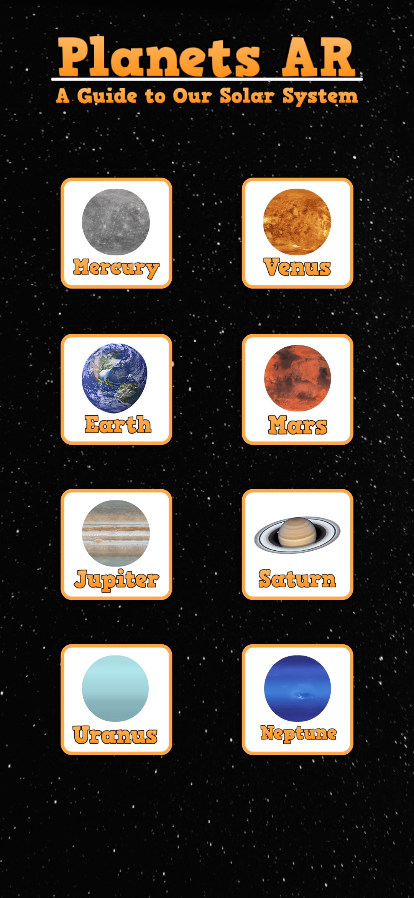
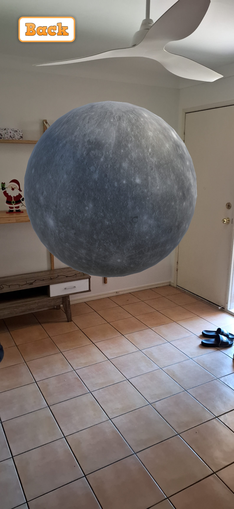
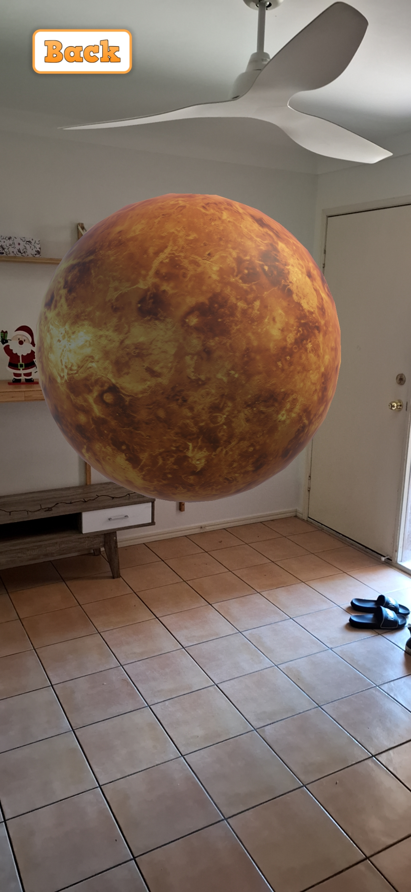
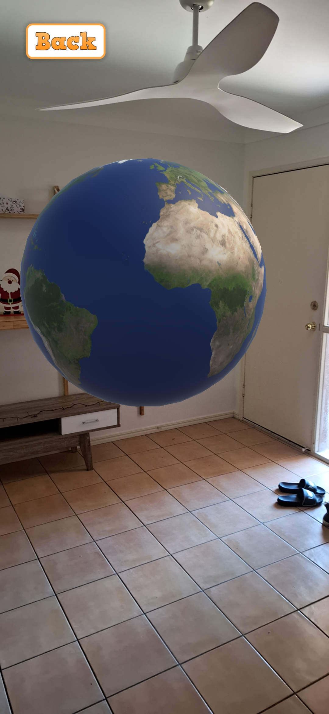
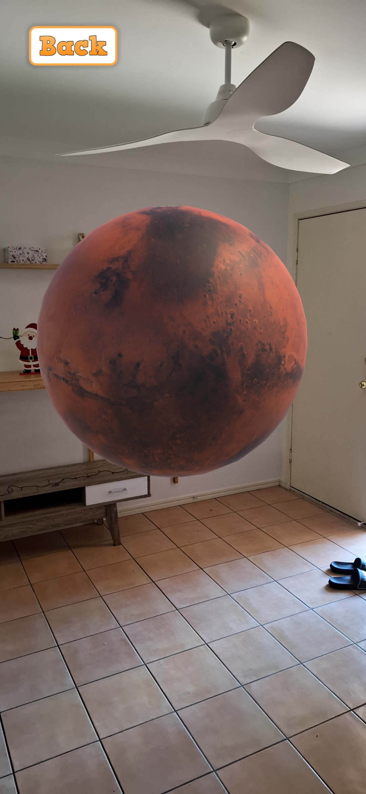
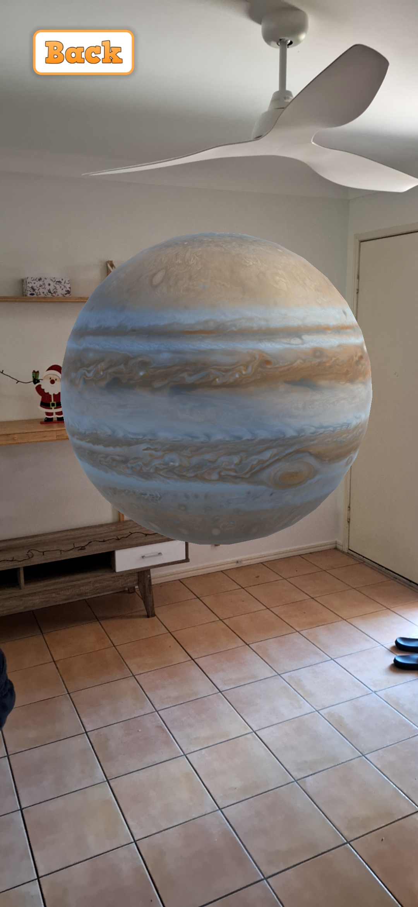
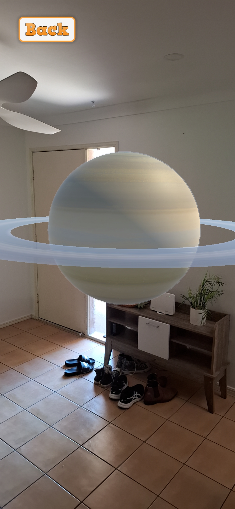
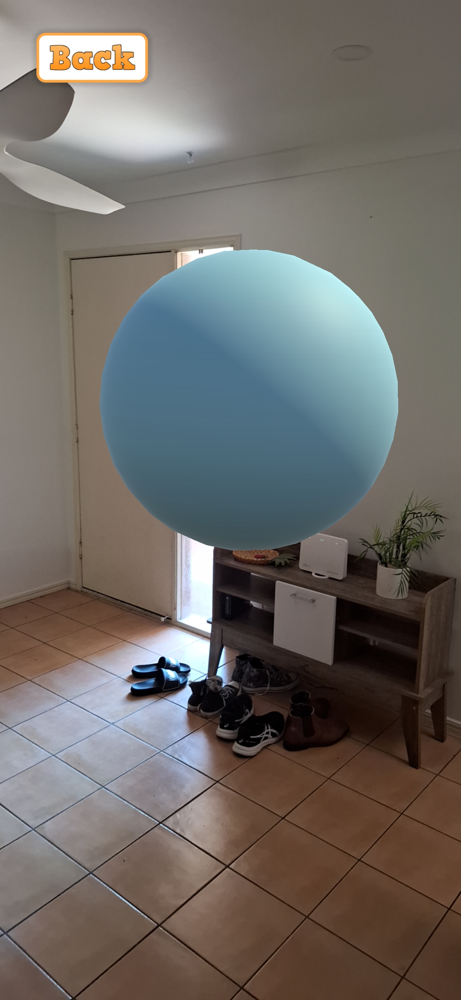
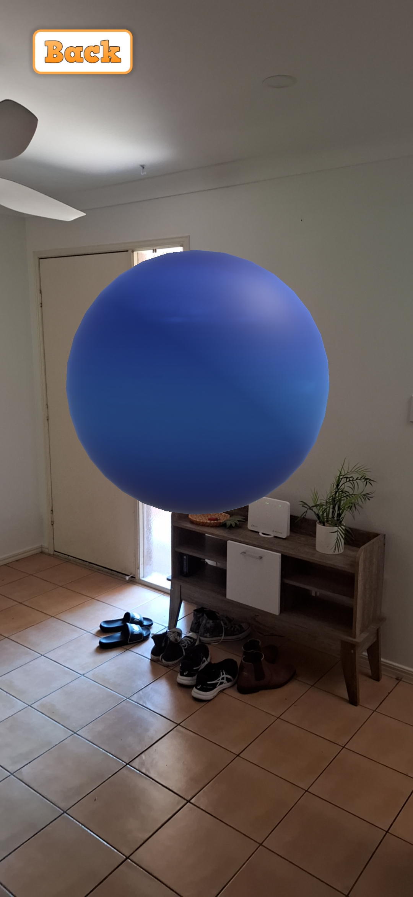

# Solar System Augmented Reality Application

 

 

## Overview

- This repository is the result of following [this tutorial](https://www.youtube.com/watch?v=FJAO6jDYljs) by Freecodecamp regarding making augmented reality applications
- The purpose of this tutorial was the strengthen my Unity skills, as well as my ability to develop applications related to an area that I am interested in, which is extended reality (XR)
- The content of the repository includes code for an augmented reality mobile application, in which the user can view 3D spinning models of all [the planets in our solar system](https://www.youtube.com/watch?v=libKVRa01L8)

## Video Examples

### Saturn

### Earth

### Mars

## Screenshots

### Main Menu

### [Mercury](https://science.nasa.gov/mercury/)

### [Venus](https://science.nasa.gov/venus/)

### [Earth](https://science.nasa.gov/earth/)

### [Mars](https://science.nasa.gov/mars/)

### [Jupiter](https://science.nasa.gov/jupiter/)

### [Saturn](https://science.nasa.gov/saturn/)

### [Uranus](https://science.nasa.gov/uranus/)

### [Neptune](https://science.nasa.gov/neptune/)

